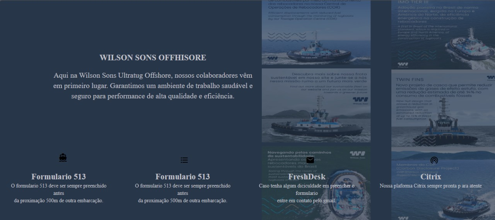

# Iniciando
<h1 align="center"> SiemWeb</h1>

Programa gratuito, promovido pela Wilson sons WEB.  
<a href=https://www.linkedin.com/company/offshoresupportbases.>Conheca nossa plataforma do linkedin</a>

  <a href="#-tecnologias">Tecnologias</a>&nbsp;&nbsp;&nbsp;|&nbsp;&nbsp;&nbsp;
  <a href="#-projeto">Projeto</a>&nbsp;&nbsp;&nbsp;|&nbsp;&nbsp;&nbsp;
  <a href="#-layout">Layout</a>&nbsp;&nbsp;&nbsp;|&nbsp;&nbsp;&nbsp;
  <a href="#memo-licença">Licença</a>

  

 

  

## 🚀 Tecnologias

Esse projeto foi desenvolvido com as seguintes tecnologias:

- HTML e CSS
- Git e Github

Feito com ♥ Wilson Sons :wave: [Participe da nossa comunidade!](https://www.linkedin.com/company/offshoresupportbases)